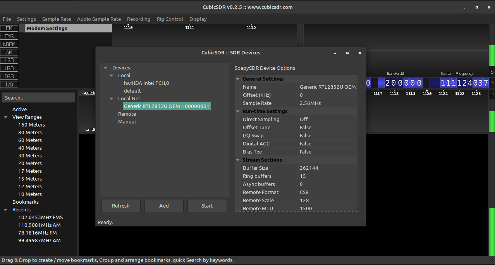

# DNCS PROJECT 2

## Assignment

Utilizing SoapySDR and it's remote support to pilot from a client an SDR installed on a server.

```text

       +--------+          +---------+
       |        |          |         |
       | CLIENT +----------| NETWORK |
       |        |          |         |
       +--------+          +---------+
                                |
                                |
                                |
                            +--------+
                            |        |
                            | SERVER |   
                            |  SDR   |
                            |        |
                            +--------+

```

### Setup

The client runs on a notebook with a `Linux Mint 20.3 Cinnamon` system, the server runs on a RaspberryPi with `Kali 2022.1` installed and both of them are connected to the network via WiFi.
The SDR device is produced by [nooelec](https://www.nooelec.com/store/) and is installed on the server.

#### ipv4 addresses

Client: `192.168.1.164`  
Server: `192.168.1.133`

#### Installing the SDR module

For this project I am using a NooElec NESDR SMArtee v2.
Using the `lsusb` command we can see that the OS has recognized the device and had loaded what it believes to be be the correct driver, listing the device as `Realtek Semiconductor Corp. RTL2838 DVB-T`.

```text

(root@kali-rpi)-[~] # lsusb         
Bus 001 Device 004: ID 1d57:ad03 Xenta [T3] 2.4GHz and IR Air Mouse Remote Control
Bus 001 Device 005: ID 0bda:2838 Realtek Semiconductor Corp. RTL2838 DVB-T
Bus 001 Device 003: ID 0424:ec00 Microchip Technology, Inc. (formerly SMSC) SMSC9512/9514 Fast Ethernet Adapter
Bus 001 Device 002: ID 0424:9514 Microchip Technology, Inc. (formerly SMSC) SMC9514 Hub
Bus 001 Device 001: ID 1d6b:0002 Linux Foundation 2.0 root hub

```

The next step is "blacklisting" the defaults drivers, done by adding the line `blacklist dvb_usb_rtl28xxu` to the file `/etc/modprobe.d/blacklist-dvb.conf`.

Finally we can install the rtl-sdr package with the `sudo apt-get install rtl-sdr` command. The device can be tested by calling the `rtl_test` command in the terminal.

This process is valid on Linux based systems, Windows based systems need to follow [this guide](https://support.nooelec.com/hc/en-us/articles/360005298053-NESDR-Installation-Guide).

## SoapySDR installation

To install SoapySDR on the server and on the client I followed the [Build Guide](https://github.com/pothosware/SoapySDR/wiki/BuildGuide) on the GitHub.

## SoapyRTLSDR installation

I followed the [wiki] to install this plugin module to interface the RTL-SDR with the SoapySDR API, both on the server and the client.

## SoapyRemote installation

To install SoapyRemote on the server I followed the building instruction on the [Remote support for Soapy SDR](https://github.com/pothosware/SoapyRemote/wiki) page on GitHub.

### This is the output of the `SoapySDRUtil --info` command on the server

```text

######################################################
##     Soapy SDR -- the SDR abstraction library     ##
######################################################

Lib Version: v0.8.1-g00e0312c
API Version: v0.8.0
ABI Version: v0.8
Install root: /usr/local
Search path:  /usr/local/lib/SoapySDR/modules0.8
Module found: /usr/local/lib/SoapySDR/modules0.8/libremoteSupport.so (0.6.0-c09b2f1)
Module found: /usr/local/lib/SoapySDR/modules0.8/librtlsdrSupport.so (0.3.2-53ee8f4)
Available factories... remote, rtlsdr
Available converters...
 -  CF32 -> [CF32, CS16, CS8, CU16, CU8]
 -  CS16 -> [CF32, CS16, CS8, CU16, CU8]
 -  CS32 -> [CS32]
 -   CS8 -> [CF32, CS16, CS8, CU16, CU8]
 -  CU16 -> [CF32, CS16, CS8]
 -   CU8 -> [CF32, CS16, CS8]
 -   F32 -> [F32, S16, S8, U16, U8]
 -   S16 -> [F32, S16, S8, U16, U8]
 -   S32 -> [S32]
 -    S8 -> [F32, S16, S8, U16, U8]
 -   U16 -> [F32, S16, S8]
 -    U8 -> [F32, S16, S8]

```

### This is the output of the `SoapySDRUtil --info` command on the client

```text

######################################################
##     Soapy SDR -- the SDR abstraction library     ##
######################################################

Lib Version: v0.8.1-g00e0312c
API Version: v0.8.0
ABI Version: v0.8
Install root: /usr/local
Search path:  /usr/local/lib/SoapySDR/modules0.8
Module found: /usr/local/lib/SoapySDR/modules0.8/librtlsdrSupport.so (0.3.2-53ee8f4)
Available factories... rtlsdr
Available converters...
 -  CF32 -> [CF32, CS16, CS8, CU16, CU8]
 -  CS16 -> [CF32, CS16, CS8, CU16, CU8]
 -  CS32 -> [CS32]
 -   CS8 -> [CF32, CS16, CS8, CU16, CU8]
 -  CU16 -> [CF32, CS16, CS8]
 -   CU8 -> [CF32, CS16, CS8]
 -   F32 -> [F32, S16, S8, U16, U8]
 -   S16 -> [F32, S16, S8, U16, U8]
 -   S32 -> [S32]
 -    S8 -> [F32, S16, S8, U16, U8]
 -   U16 -> [F32, S16, S8]
 -    U8 -> [F32, S16, S8]

```

As we can see, the only difference is the remote module, which was only installed on the server.

### Soapy server initialization

To start the Soapy Server and utilize the SDR module remotely it is sufficient to run the `SoapySDRServer --bind` command in the shell environment.

```text

######################################################
## Soapy Server -- Use any Soapy SDR remotely
######################################################

Server version: 0.6.0-gc09b2f10
Server UUID: cf57863e-a583-16d8-8567-7e70007f0101
Launching the server... tcp://[::]:55132
Server bound to [::]:55132
Launching discovery server... 
Connecting to DNS-SD daemon... 
[INFO] Avahi version:  (null)
[INFO] Avahi hostname: (null)
[INFO] Avahi domain:   (null)
[INFO] Avahi FQDN:     (null)
[ERROR] avahi_entry_group_new() failed

```

I was worried about `[ERROR] avahi_entry_group_new() failed`.
I serched many ways to resolve the issue, even if it didn't affect the server-client communication in a detectable(from me, at least...) way, but I couldn't find a solution to it.
I tried to install the `SoapyRemote` on a `Raspian` system and that error never showed up while binding the server, so I suppose it stems from my lack of knowledge about Linux based systems.

## Using CubicSDR with the Local Net Device

Why CubucSDR?
It was a software I had alredy seen used in some video tutorials about SDR modules and it was easy to find and select the SDR module over the Network, as shown in the image below:



Opening CubicSDR and selecting the Local Net module triggers an output from the server:

```text

Detached kernel driver
Found Rafael Micro R820T tuner
Reattached kernel driver
SoapyServerListener::close()
SoapyServerListener::close()
SoapyServerListener::accept([::ffff:192.168.1.164]:53936)
SoapyServerListener::accept([::ffff:192.168.1.164]:53938)
SoapyServerListener::accept([::ffff:192.168.1.164]:53940)
SoapyServerListener::close()
SoapyServerListener::close()
SoapyServerListener::accept([::ffff:192.168.1.164]:53942)
Detached kernel driver
Found Rafael Micro R820T tuner
Reattached kernel driver
SoapyServerListener::close()
SoapyServerListener::close()
SoapyServerListener::accept([::ffff:192.168.1.164]:53946)
SoapyServerListener::accept([::ffff:192.168.1.164]:53948)
SoapyServerListener::accept([::ffff:192.168.1.164]:53950)
SoapyServerListener::close()
SoapyServerListener::close()
SoapyServerListener::accept([::ffff:192.168.1.164]:53952)
Detached kernel driver
Found Rafael Micro R820T tuner
[R82XX] PLL not locked!
Allocating 15 zero-copy buffers
Disabled direct sampling mode

```

## Wireshark

I used [Wireshark](https://www.wireshark.org/) to capture the packets exchanged between client and server, here is an extract of the packets listened to

```text

No.     Time           Source                Destination     Protocol Length Info

125     0.039227602    192.168.1.164         192.168.1.133   UDP      68     37604 → 58586 Len=24
126     0.039555088    192.168.1.133         192.168.1.164   UDP      1496   58586 → 37604 Len=1452
127     0.039555153    192.168.1.133         192.168.1.164   UDP      1496   58586 → 37604 Len=1452
128     0.039555181    192.168.1.133         192.168.1.164   UDP      1496   58586 → 37604 Len=1452
129     0.040016214    192.168.1.133         192.168.1.164   UDP      1496   58586 → 37604 Len=1452
130     0.040016282    192.168.1.133         192.168.1.164   TCP      99     55132 → 37920 [PSH, ACK] Seq=1 Ack=1 Win=32
    Len=31 TSval=246854745 TSecr=1515470716
131     0.040383079    192.168.1.133         192.168.1.164   UDP      1496   58586 → 37604 Len=1452
132     0.040748704    192.168.1.133         192.168.1.164   UDP      1496   58586 → 37604 Len=1452
133     0.040748771    192.168.1.133         192.168.1.164   UDP      1496   58586 → 37604 Len=1452
134     0.041135746    192.168.1.133         192.168.1.164   UDP      1496   58586 → 37604 Len=1452
135     0.041135814    192.168.1.133         192.168.1.164   UDP      1496   58586 → 37604 Len=1452
136     0.041135842    192.168.1.133         192.168.1.164   UDP      1496   58586 → 37604 Len=1452
137     0.041135871    192.168.1.133         192.168.1.164   UDP      1496   58586 → 37604 Len=1452
138     0.041453176    192.168.1.133         192.168.1.164   UDP      1496   58586 → 37604 Len=1452
139     0.042176577    192.168.1.133         192.168.1.164   UDP      1496   58586 → 37604 Len=1452
140     0.042176642    192.168.1.133         192.168.1.164   UDP      1496   58586 → 37604 Len=1452
141     0.042516079    192.168.1.133         192.168.1.164   UDP      1496   58586 → 37604 Len=1452
142     0.042516119    192.168.1.133         192.168.1.164   UDP      1496   58586 → 37604 Len=1452
143     0.042574703    192.168.1.164         192.168.1.133   UDP      68     37604 → 58586 Len=24
144     0.043087202    192.168.1.133         192.168.1.164   UDP      1496   58586 → 37604 Len=1452
145     0.043087281    192.168.1.133         192.168.1.164   UDP      1496   58586 → 37604 Len=1452
146     0.043455987    192.168.1.133         192.168.1.164   UDP      1496   58586 → 37604 Len=1452
147     0.043456056    192.168.1.133         192.168.1.164   UDP      1496   58586 → 37604 Len=1452
148     0.043774248    192.168.1.133         192.168.1.164   UDP      1496   58586 → 37604 Len=1452
149     0.044463176    192.168.1.133         192.168.1.164   UDP      1496   58586 → 37604 Len=1452
150     0.044463242    192.168.1.133         192.168.1.164   UDP      1496   58586 → 37604 Len=1452
151     0.044824321    192.168.1.133         192.168.1.164   UDP      1496   58586 → 37604 Len=1452
152     0.044824386    192.168.1.133         192.168.1.164   UDP      1496   58586 → 37604 Len=1452
153     0.044824416    192.168.1.133         192.168.1.164   UDP      1496   58586 → 37604 Len=1452
154     0.044824445    192.168.1.133         192.168.1.164   UDP      1496   58586 → 37604 Len=1452
155     0.045347785    192.168.1.133         192.168.1.164   UDP      1496   58586 → 37604 Len=1452
156     0.048898163    192.168.1.133         192.168.1.164   UDP      1496   58586 → 37604 Len=1452
157     0.050110120    192.168.1.133         192.168.1.164   UDP      1496   58586 → 37604 Len=1452
158     0.050110186    192.168.1.133         192.168.1.164   UDP      1496   58586 → 37604 Len=1452
159     0.050110215    192.168.1.133         192.168.1.164   UDP      1496   58586 → 37604 Len=1452
160     0.051853949    192.168.1.133         192.168.1.164   UDP      1496   58586 → 37604 Len=1452
161     0.051854007    192.168.1.133         192.168.1.164   UDP      1496   58586 → 37604 Len=1452
162     0.051854036    192.168.1.133         192.168.1.164   UDP      1496   58586 → 37604 Len=1452
163     0.051854064    192.168.1.133         192.168.1.164   UDP      1496   58586 → 37604 Len=1452
164     0.051854092    192.168.1.133         192.168.1.164   UDP      1496   58586 → 37604 Len=1452

```

Here are the details from a captured packet:

```text

No.     Time           Source                Destination           Protocol Length Info
135     0.041135814    192.168.1.133         192.168.1.164         UDP      1496   58586 → 37604 Len=1452

Frame 135: 1496 bytes on wire (11968 bits), 1496 bytes captured (11968 bits) on interface any, id 0
    Interface id: 0 (any)
        Interface name: any
    Encapsulation type: Linux cooked-mode capture (25)
    Arrival Time: Mar  9, 2022 10:01:22.605693867 CET
    [Time shift for this packet: 0.000000000 seconds]
    Epoch Time: 1646816482.605693867 seconds
    [Time delta from previous captured frame: 0.000000068 seconds]
    [Time delta from previous displayed frame: 0.000000068 seconds]
    [Time since reference or first frame: 0.041135814 seconds]
    Frame Number: 135
    Frame Length: 1496 bytes (11968 bits)
    Capture Length: 1496 bytes (11968 bits)
    [Frame is marked: False]
    [Frame is ignored: False]
    [Protocols in frame: sll:ethertype:ip:udp:data]
    [Coloring Rule Name: UDP]
    [Coloring Rule String: udp]
Linux cooked capture
    Packet type: Unicast to us (0)
    Link-layer address type: 1
    Link-layer address length: 6
    Source: Raspberr_7d:b9:0d (b8:27:eb:7d:b9:0d)
    Unused: 0000
    Protocol: IPv4 (0x0800)
Internet Protocol Version 4, Src: 192.168.1.133, Dst: 192.168.1.164
    0100 .... = Version: 4
    .... 0101 = Header Length: 20 bytes (5)
    Differentiated Services Field: 0x00 (DSCP: CS0, ECN: Not-ECT)
    Total Length: 1480
    Identification: 0x1cee (7406)
    Flags: 0x4000, Don't fragment
        0... .... .... .... = Reserved bit: Not set
        .1.. .... .... .... = Don't fragment: Set
        ..0. .... .... .... = More fragments: Not set
    Fragment offset: 0
    Time to live: 64
    Protocol: UDP (17)
    Header checksum: 0x93bd [validation disabled]
    [Header checksum status: Unverified]
    Source: 192.168.1.133
    Destination: 192.168.1.164
User Datagram Protocol, Src Port: 58586, Dst Port: 37604
    Source Port: 58586
    Destination Port: 37604
    Length: 1460
    Checksum: 0x4cee [correct]
        [Calculated Checksum: 0x4cee]
    [Checksum Status: Good]
    [Stream index: 0]
    [Timestamps]
Data (1452 bytes)

```
